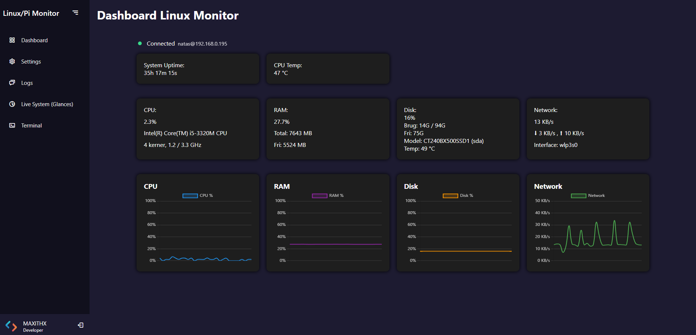
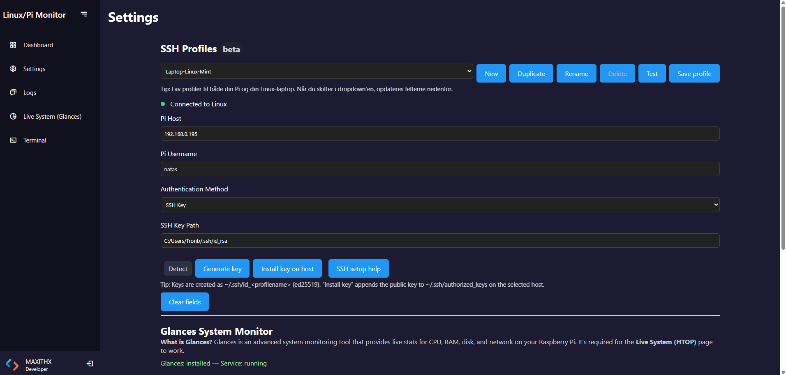
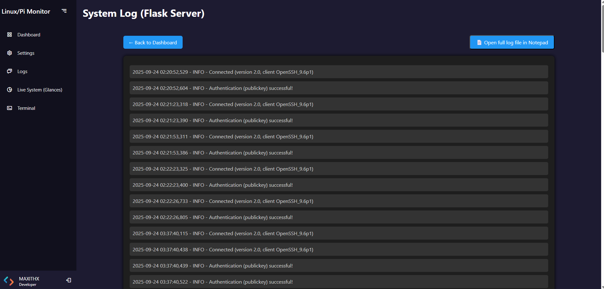
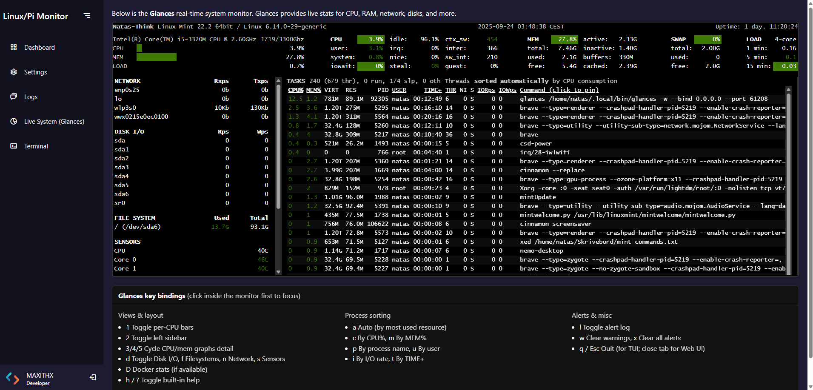
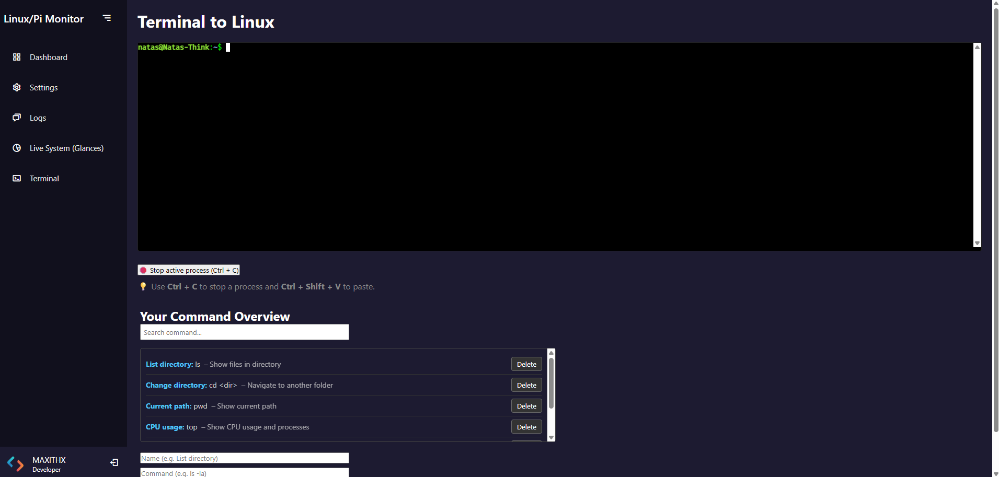

## 📸 Screenshots
- [Dashboard](#dashboard)
- [Settings (SSH/Glances)](#settings)
- [Terminal](#terminal)
- [Live System (Glances)](#live-system-glances)
- [Logs](#logs)

# Linux Pi Monitor

**Linux Pi Monitor** is a fast, modern web app (Python + Flask) for monitoring and managing Linux and Raspberry Pi machines **over SSH** — from your Windows PC.  
It features a live dashboard with charts, a built-in web terminal, one-click Glances installation, and **multi-profile** SSH management (keys or passwords).

---

## ✨ Highlights

- **Multi-profile SSH**: Save multiple hosts (Pi, Linux laptop/server), switch instantly.
- **Key or password auth**:
  - Generate per-profile **ed25519** keys.
  - One-click **Install key on host** (adds to `~/.ssh/authorized_keys`).
  - Key **detection** & **smart path suggestions** (`~/.ssh/id_<profilename>`).
- **Connection indicator**: Realtime status (connected/disconnected) that follows the selected profile.
- **Live dashboard**:
  - Uptime, CPU temp, CPU model/cores/freq
  - RAM total/usage
  - Disk model/device/temp + usage
  - Network interface + live RX/TX
  - Smooth charts (CPU %, RAM %, Disk %, Network KB/s)
- **Glances integration**:
  - One-click **Install/Start/View log/Uninstall**
  - Runs as a **systemd service** on the remote host
  - Dedicated **Live System (Glances)** page
- **Built-in terminal**: Web SSH terminal (xterm.js) with color output and history.
- **Dark theme**, responsive layout, snappy UI.

---

## 🧰 Tech Stack

- **Backend**: Python 3, Flask, Paramiko (SSH)
- **Frontend**: HTML/CSS/JavaScript, Chart.js, xterm.js
- **System monitor**: Glances (remote), systemd service
- **Platform**: Developed and run from Windows (works great without extra build steps)

---

## 📦 Install & Run (Windows)

> The app runs locally on your Windows machine and connects to your Linux/Pi over SSH.

1. **Clone**
   ```bash
   git clone https://github.com/Maxithx/linux-pi-monitor.git
   cd linux-pi-monitor

# Linux Pi Monitor

**Linux Pi Monitor** is a fast, modern web app (Python + Flask) for monitoring and managing Linux and Raspberry Pi machines **over SSH** — from your Windows PC.  
It features a live dashboard with charts, a built-in web terminal, one-click Glances installation, and **multi-profile** SSH management (keys or passwords).

---

## ✨ Highlights

- **Multi-profile SSH**: Save multiple hosts (Pi, Linux laptop/server), switch instantly.
- **Key or password auth**:
  - Generate per-profile **ed25519** keys.
  - One-click **Install key on host** (adds to `~/.ssh/authorized_keys`).
  - Key **detection** & **smart path suggestions** (`~/.ssh/id_<profilename>`).
- **Connection indicator**: Realtime status (connected/disconnected) that follows the selected profile.
- **Live dashboard**:
  - Uptime, CPU temp, CPU model/cores/freq
  - RAM total/usage
  - Disk model/device/temp + usage
  - Network interface + live RX/TX
  - Smooth charts (CPU %, RAM %, Disk %, Network KB/s)
- **Glances integration**:
  - One-click **Install/Start/View log/Uninstall**
  - Runs as a **systemd service** on the remote host
  - Dedicated **Live System (Glances)** page
- **Built-in terminal**: Web SSH terminal (xterm.js) with color output and history.
- **Dark theme**, responsive layout, snappy UI.

---

## 🧰 Tech Stack

- **Backend**: Python 3, Flask, Paramiko (SSH)
- **Frontend**: HTML/CSS/JavaScript, Chart.js, xterm.js
- **System monitor**: Glances (remote), systemd service
- **Platform**: Developed and run from Windows (works great without extra build steps)

---

## 📦 Install & Run (Windows)

> The app runs locally on your Windows machine and connects to your Linux/Pi over SSH.

1. **Clone**
   ```bash
   git clone https://github.com/Maxithx/linux-pi-monitor.git
   cd linux-pi-monitor

2. **Create venv & install deps**

python -m venv .venv
.venv\Scripts\activate
pip install -r requirements.txt


3. **Start**

python app.py

Open: http://127.0.0.1:8080

Tip: Ensure SSH is enabled on your Raspberry Pi / Linux host and that you can reach it from your Windows machine.

🔐 SSH Features (Details)

Profiles: New, Duplicate, Rename, Delete, Save. Active profile is shared across pages.

Auth methods:

SSH Key: Generate ed25519 key, install public key on host (prompts once for password), suggest/detect key paths.

Password: Store per-profile (optional; key auth recommended).

Status checks:

Fast /profiles/test?quick=1 checks without blocking.

UI updates indicator immediately on profile switch or save.

📊 Glances (Remote System Monitor)

From Settings → Glances:

Install Glances (and dependencies) remotely via SSH.

Start Glances service (systemd).

View Glances log and service log directly in the app.

Uninstall when needed.

There’s a dedicated Live System (Glances) page that embeds the Glances Web UI for HTOP-style detail (per-CPU, processes, disk IO, etc.).

🖥️ Built-in Terminal

Web SSH terminal (xterm.js) inside the app.

Color output, auto-scroll, and command history.

Perfect for quick admin tasks without leaving the browser.

🧩 Extra Tools

On the Settings page you can install/remove optional terminal tools:

Neofetch

CMatrix

🗂️ Project Structure (simplified)
linux-pi-monitor/
├─ app.py                    # Flask app entrypoint
├─ routes/                   # Flask blueprints & server logic
├─ static/
│  ├─ css/                   # Styles
│  └─ js/                    # Frontend logic (profiles, glances, charts, terminal)
├─ templates/                # Jinja2 HTML templates (Dashboard, Settings, Glances, Terminal, Logs)
├─ requirements.txt          # Python dependencies
├─ full_requirements.txt     # (optional, dev)
└─ README.md                 # This file

✅ Supported Targets

Remote: Raspberry Pi OS / Debian / Ubuntu (systemd available)

Local runner: Windows 10/11 (Python 3.10+ recommended)

You’ll need a user with permission to install packages/start services on the remote host (typically via sudo).

🔧 Troubleshooting

“No connection to Linux”:

Check host/IP, username, and auth method in Settings.

If using keys, click Install key on host once, or ensure your public key exists in ~/.ssh/authorized_keys on the remote host.

Glances won’t start:

View Glances log and service log from the Settings page.

Ensure systemd is present and the user can sudo systemctl ....

Charts look flat:

Give it a minute; the dashboard samples continuously.

Network values are in KB/s (not Kb/s).

🗺️ Roadmap

Language switcher (Danish/English UI)

Packaging as .exe (optional)

Auto-update channel

More charts (per-core, disk IO, net per-iface)

Custom alerts (CPU temp, disk space)

🖼️ Screenshots

Add screenshots of Dashboard, Settings (SSH/Glances), Terminal, Glances page here.









