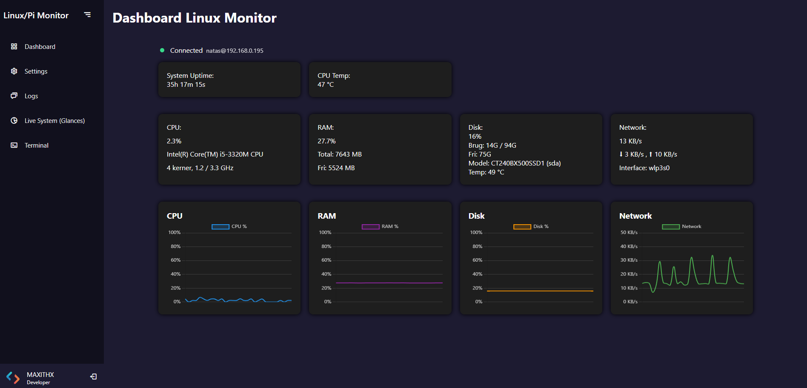
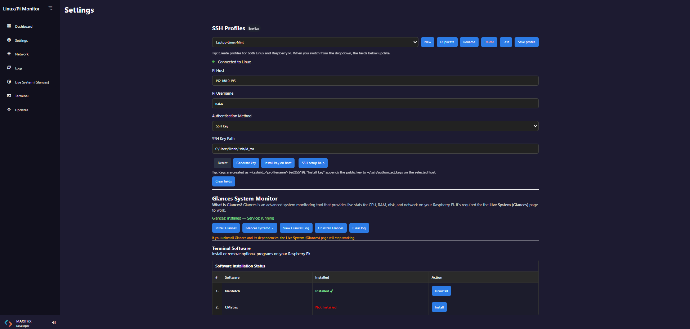
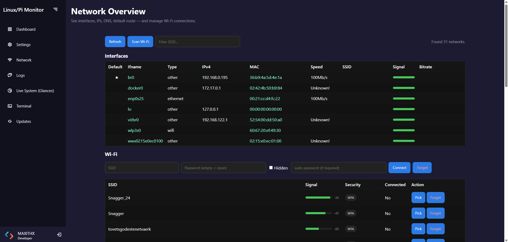
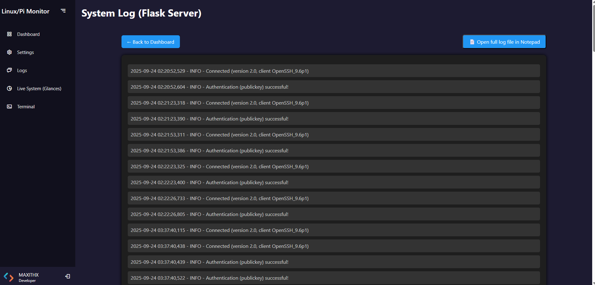
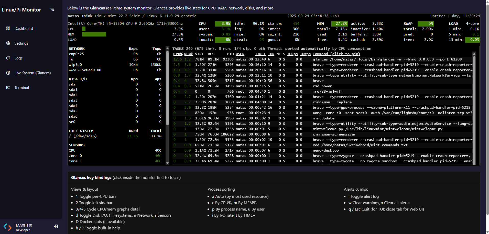
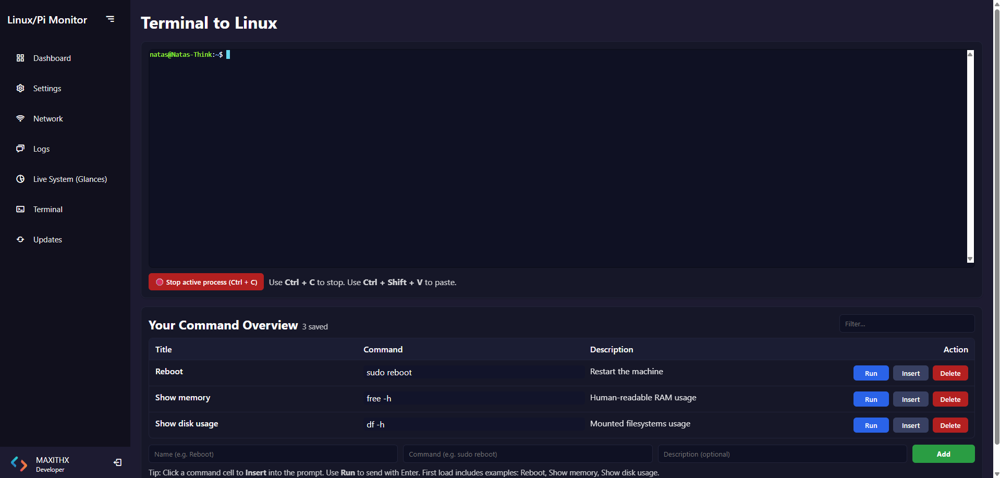
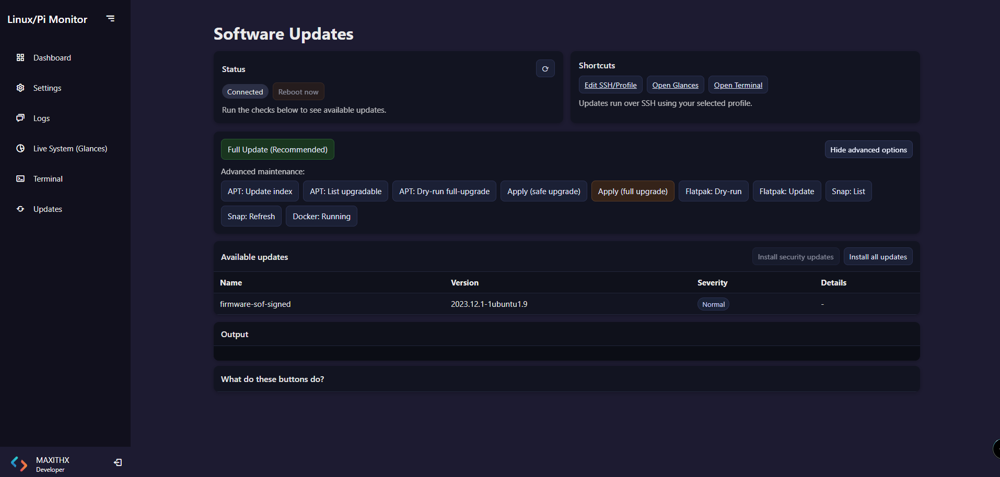

# Linux Pi Monitor

Linux Pi Monitor is a fast, modern web application (Python + Flask) for monitoring and managing Linux and Raspberry Pi machines over SSH — directly from your Windows PC.

It features a live dashboard with charts, a built-in web terminal, one-click Glances installation, a System Update Center, a Network & DNS Manager, and multi-profile SSH management (keys or passwords).

---

## Screenshots & Navigation

| Feature | Description | Link |
| :--- | :--- | :--- |
| Dashboard | CPU, RAM, disk, temperatures, and mini charts. | [View Dashboard](#dashboard) |
| Settings | Manage SSH profiles, keys, and Glances service. | [View Settings](#settings) |
| Network | Interface overview, Wi-Fi scanning, and live DNS control. | [View Network](#network) |
| Logs | View service and application logs directly in the browser. | [View Logs](#logs) |
| Live Monitor | Embedded Glances Web UI for detailed system monitoring. | [View Live Monitor](#live-system-glances) |
| Terminal | Full-width xterm.js terminal with saved commands. | [View Terminal](#terminal) |
| Drivers | Detect Linux drivers per OS (Debian, Mint) and display versions. | [View Drivers](#drivers) |
| Update Center | Run security and full system upgrades with locked buttons during processing. | [View Update Center](#update-center) |

---

## Highlights

- Multi-profile SSH: Save multiple hosts (Pi, Linux server), switch instantly.
- Secure Authentication: Generate ed25519 keys and install the public key on the host with one click.
- Glances Integration: Install, start, stop, and view logs for the Glances service remotely.
- Network & DNS Manager:
  - View active interfaces, IPv4, MAC, and SSID.
  - Change DNS servers live (Google, Cloudflare, Quad9, or Custom).
  - Automatic detection of active connection and systemd-resolved method.
- Driver Detection:
  - Detect and manage OS-specific drivers (Debian, Mint).
  - Future support for automatic driver install/uninstall.
- Update Center:
  - Displays available APT updates with severity and details.
  - Buttons are locked while loading or installing, to prevent conflicts.
- Windows Host: The app runs locally on your Windows machine (Python 3.10+ required).

---

## Install & Run (Windows)

> The app runs locally on your Windows machine and connects to your Linux/Pi host over SSH.

1) Clone the repository
```
git clone https://github.com/Maxithx/linux-pi-monitor.git
cd linux-pi-monitor
```

2) Create venv & install dependencies
```
python -m venv .venv
.venv\Scripts\activate
pip install -r requirements.txt
```

3) Start the application
```
python app.py
```
Open: http://127.0.0.1:8080 in your browser.

---

## Screenshots

<a id="dashboard"></a>
### Dashboard


<a id="settings"></a>
### Settings


<a id="network"></a>
### Network


<a id="logs"></a>
### Logs


<a id="live-system-glances"></a>
### Live System Monitor (Glances)


<a id="terminal"></a>
### Terminal


<a id="drivers"></a>
### Drivers


<a id="update-center"></a>
### Update Center


---

## Tech Stack

- Backend: Python 3, Flask, Paramiko (SSH)
- Frontend: HTML/CSS/JavaScript, Chart.js, xterm.js
- System Monitor: Glances (remote), systemd service
- Modules:
  - `routes/network/` — modularized DNS, Wi‑Fi, and summary views
  - `routes/drivers/` — OS driver utilities (updates + drivers page)
- Platform: Windows 10/11 (Python 3.10+ recommended)

---

## Roadmap & Contribution

Future enhancements include:
- Language switcher (UI localization).
- Packaging as an executable.
- Driver auto-update integration.
- More detailed charts (per-core, disk IO).

Feel free to contribute to the project! See the repository for details.

---

## Change Log

### v1.7 – Feature-Folder Routes Refactor
- Restructured `routes/` into feature packages with clear blueprints:
  - `routes/settings/` (views_settings, views_profiles, glances_manage, glances, software)
  - `routes/network/` (unchanged structure)
  - `routes/updates/` (views_updates)
  - `routes/drivers/` (views_drivers + OS drivers: `os_base.py`, `os_debian.py`, `os_mint.py`, `os_detect.py`)
  - `routes/terminal/` (views_terminal) and `routes/logs/` (views_logs)
  - Shared helpers moved to `routes/common/` (e.g., `ssh_utils.py`)
- Updated imports across the app to use the new package layout.
- Blueprints wired centrally; kept all existing URL paths intact to avoid breaking JS/templates.
- Consolidated OS update drivers under `routes/drivers/` and updated Update Center to import from there.
- Minor docstrings and comments updated to reflect new structure.

### v1.6 – DNS & Drivers Update
- Split `network.py` into modular structure:
  - `helpers.py`, `views_dns.py`, `views_wifi.py`, `views_summary.py`, `dns_helpers.py`.
- Added live DNS Manager with Google, Cloudflare, Quad9 and custom presets.
- Added Drivers page (auto-detects Mint/Debian drivers and kernel modules).
- Improved sudo handling (no `[sudo] password` prompt text in logs).
- DNS changes now use `nmcli reapply` instead of full reconnect — no more Wi‑Fi disconnects.
- Added display of Stub + Upstream DNS in network header.
- Minor UI/UX polish across Network and Drivers pages.

### v1.5 – Update Center Improvements
- Buttons for Full Update, Security Update, and All Updates are disabled while loading or installing.
- Prevents accidental double actions.
- Added `setBusy()` helper in JS + CSS disabled styling.
- Smoothed loading state and aria-busy support for accessibility.

### v1.4 – System Stability & Glances Integration
- Improved Glances installation and control.
- Added retry logic for SSH commands.
- Enhanced error output and timeout handling.

### v1.3 – Multi-profile SSH & Terminal
- Multiple profile support with quick-switch dropdown.
- Added live xterm.js terminal with scroll and custom color scheme.
- Added saved command overview.

### v1.2 – Core UI Framework
- Sidebar navigation with persistent state.
- Unified CSS grid layout for all pages.
- Base dark theme and responsive structure.

### v1.0 – Initial Release
- First public release of Linux Pi Monitor.
- Core Flask structure, SSH connection, system summary, update check.

---

© 2025 THXMAN Labs — Developed by Thomas & ChatGPT

