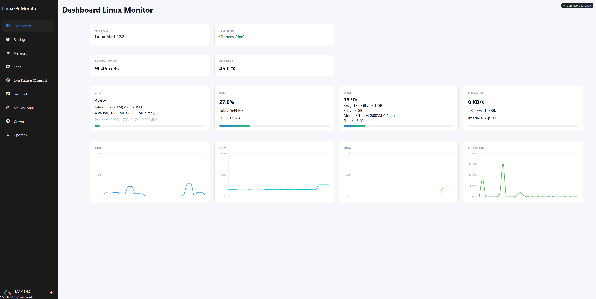
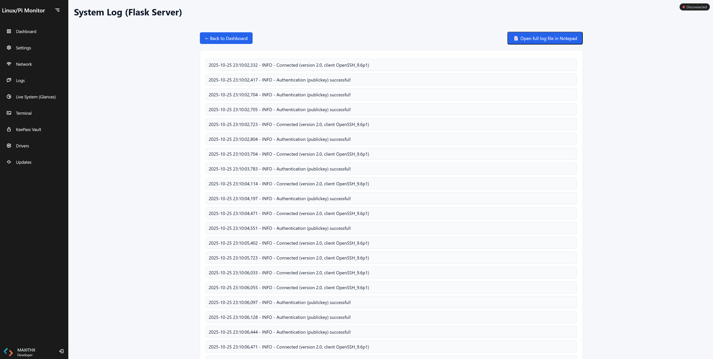
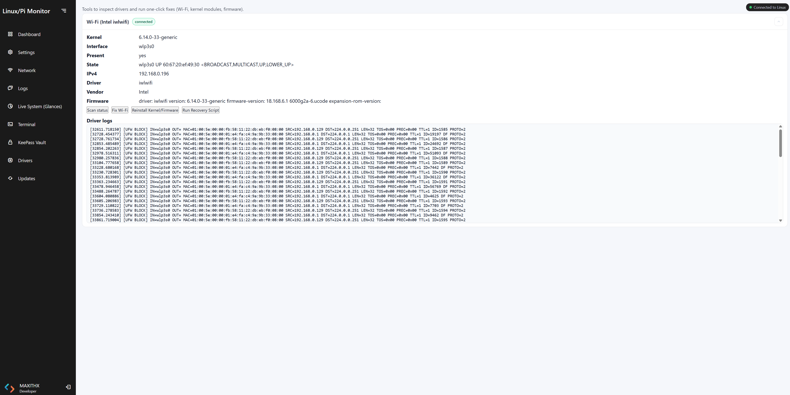

# Linux Pi Monitor

Linux Pi Monitor is a fast, modern web application (Python + Flask) for monitoring and managing Linux and Raspberry Pi machines over SSH — directly from your Windows PC.

It features a live dashboard with charts, a built-in web terminal, one-click Glances installation, a System Update Center, a Network & DNS Manager, and multi-profile SSH management (keys or passwords).

---

## Screenshots & Navigation

| Feature | Description | Link |
| :--- | :--- | :--- |
| Dashboard | CPU, RAM, disk, temperatures, and mini charts. | [View Dashboard](#dashboard) |
| Settings | Manage SSH profiles, keys, and Glances service. | [View Settings](#settings) |
| Network and firewall| Interface overview, Wi-Fi scanning, and live DNS control. | [View Network](#network) |
| Logs | View service and application logs directly in the browser. | [View Logs](#logs) |
| Live Monitor | Embedded Glances Web UI for detailed system monitoring. | [View Live Monitor](#live-system-glances) |
| KeePass Vault | Phased Samba share setup for KeePass vaults + Windows helper. | [View KeePass Vault](#keepass) |
| Terminal | Full-width xterm.js terminal with saved commands. | [View Terminal](#terminal) |
| Drivers | Detect Linux drivers per OS (Debian, Mint) and display versions. | [View Drivers](#drivers) |
| Update Center | Run security and full system upgrades with locked buttons during processing. | [View Update Center](#update-center) |

---

## Highlights

- Multi-profile SSH & secure auth  
  Save multiple hosts (Pi, Mint, Debian) and switch instantly. Generate ed25519 keys and push the public key to the target with one click.
- Update Center with live progress  
  Overall + per-package progress bars, sequential “Full/Noob” workflows, detailed install logs, and buttons that lock/unlock automatically so parallel installs never collide.
- Network, DNS & Firewall hub  
  Interface overview with Wi-Fi scanning, live DNS presets/custom servers, plus a full firewall view (UFW/firewalld) for enabling profiles or toggling rules without leaving the browser.
- Glances + Live Dashboard  
  Install, start, stop, and inspect logs for Glances; the embedded live view auto-targets the selected SSH profile. The dashboard tiles show CPU, RAM, disk, temps, and sparkline history.
- KeePass Vault & Windows helper  
  Phased Samba share setup (deps → share → firewall → verify) with rollback logs and a ready-to-copy `net use` command for mapping the vault from Windows.
- Terminal, Logs & Drivers  
  Full-width xterm.js console with saved commands, searchable log viewer, and driver detection for Debian/Mint derivatives.
- Windows-first hosting  
  Runs locally on Windows 10/11 (Python 3.10+) but works equally well on Linux/Mint/Raspbian for headless deployments.

---

## Theme Palette (Light UI)

The UI now uses a light, desaturated palette with navy accents. Core tokens are defined in `static/css/dashboard.css` and shared across every page:

```
:root {
  --bg: #f4f6fb;        /* page background */
  --surface: #ffffff;   /* cards and panels */
  --text: #0f172a;      /* primary text */
  --muted: #64748b;     /* secondary text */
  --primary: #2d7be1;   /* actions/links */
  --card-border: rgba(15,23,42,0.08);
}
```

Highlights:
- Sidebar + cards inherit light surfaces with soft borders to match the rest of the Windows app ecosystem.
- Charts keep Google-like colors while RAM adopts the primary accent.
- Updates, Network, Firewall, Settings, and Terminal pages now share the same light layout and spacing for consistency.
- Terminal (xterm.js) uses a deep navy background with cyan cursor so it stands out against the rest of the light UI.

Guideline: when adding new views, stick to `var(--surface)` and `var(--card-border)` to stay aligned with the light design.

---

## Install & Run

This project supports two simple ways to run:

- **A. No Conda (works everywhere)** — Recommended for portability (Windows / Linux / Raspbian).
- **B. With Conda (Windows 10/11)** — Great if you prefer Conda-managed Python on Windows.

### A. Run without Conda (universal)

> Works on Windows 11, Linux Mint, and Raspbian using a plain Python virtual environment (venv).

1) Clone the repository
```bash
git clone https://github.com/Maxithx/linux-pi-monitor.git
cd linux-pi-monitor
```

2) Create & activate venv, install dependencies, run

**Windows (CMD/PowerShell)**
```bat
py -m venv .venv
.\.venv\Scriptsctivate
pip install -r requirements.txt
python app.py
```

**Linux (Mint / Raspbian)**
```bash
python3 -m venv .venv    # or: python3.12 -m venv .venv
source .venv/bin/activate
pip install -r requirements.txt
python app.py
```

Open: http://127.0.0.1:8080

To stop the app: `Ctrl+C`  
To deactivate the venv: `deactivate`

#### Multi-worker servers (recommended)

- Windows (development): Waitress with threads

  ```bat
  pip install waitress
  waitress-serve --threads=4 app:app
  ```

- Linux (Mint / Pi, dev or prod): Gunicorn with workers + threads

  ```bash
  pip install gunicorn
  gunicorn -w 2 --threads 4 -b 0.0.0.0:8080 app:app
  ```

Notes
- The built-in Flask dev server is fine for local development, but use a multi-worker server for responsiveness under load (updates run in background threads).
- If you use Flask-SocketIO features, keep eventlet installed; Gunicorn works well with threads for the HTTP routes used by Updates.
### Dev quick tip: restart after backend edits

If you edit backend Python files (routes, helpers, or templates used by Flask) while the server is running, restart the process to ensure changes load cleanly. In development you can also enable Flask's reloader, but a manual restart avoids stale compiled state.

- Restart the Python app (Ctrl+C, then `python app.py`).
- Hard refresh the browser (Ctrl+F5) so updated JS is loaded.

---

### B. Run with Conda (Windows 10/11)

> Keeps your system Python clean and runs everything inside an isolated Conda environment.

1) Clone the repository
```bat
git clone https://github.com/Maxithx/linux-pi-monitor.git
cd linux-pi-monitor
```

2) Create & activate Conda environment, install dependencies, run
```bat
conda create -n linux-pi-monitor-clean python=3.12 -y
conda activate linux-pi-monitor-clean
pip install -r requirements.txt
python app.py
```

Open: http://127.0.0.1:8080

**Notes**
- Always `conda activate linux-pi-monitor-clean` before running `pip` or `python`.
- Keep channels simple (`conda-forge` + `defaults`).
- Avoid `prefix:` in `environment.yml` (non-portable), if you later add one.

---

<!-- Optional one-click scripts section removed (not used) -->

## Screenshots

<a id="dashboard"></a>
### Dashboard


<a id="settings"></a>
### Settings


<a id="network"></a>
### Network


<a id="logs"></a>
### Logs


<a id="live-system-glances"></a>
### Live System Monitor (Glances)


<a id="terminal"></a>
### Terminal


<a id="drivers"></a>
### Drivers


<a id="update-center"></a>
### Update Center


<a id="keepass"></a>
### KeePass Vault

This page provides a guided, phased setup to host a local-only Samba share for your KeePass vault, plus a Windows mapping helper.


---

## Recent changes

- Update Center UX (v0.5.4)
  - Added light overall progress meter + per-package bars that stay in sync with apt output.
  - “Full/Noob” workflows now run every action sequentially and show completion states in the table (“Installation done” + Installed buttons).
  - Manual installs no longer disappear; rows stay visible so you can see what was just applied.
- Light UI refresh
  - Cards, tables, and buttons now share the same light palette; README screenshots updated accordingly.
  - Firewall view was pulled forward into the Network section with its own screenshot.
- Wi-Fi scan reliability
  - Avoid needing two clicks: after triggering nmcli rescan, the backend briefly retries the list while NetworkManager warms up its cache.
  - Connected marking is more robust: considers nmcli IN-USE, active BSSID/SSID (case-insensitive), and the active nmcli connection name.
